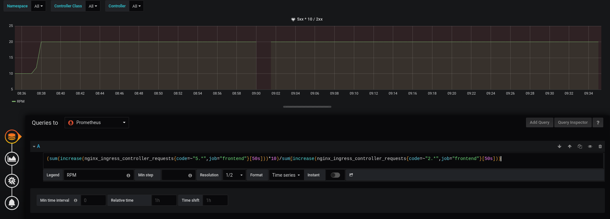
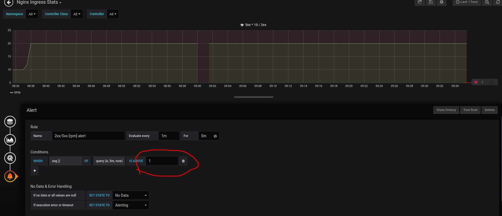
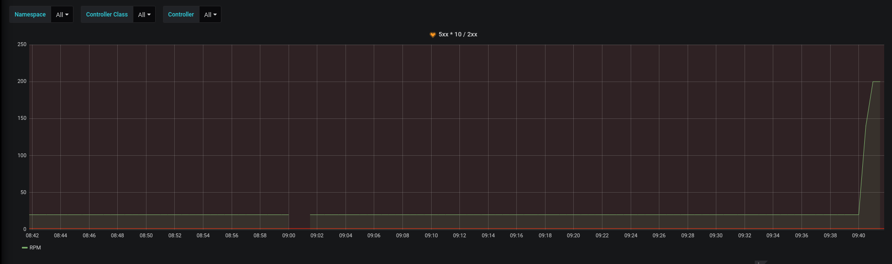
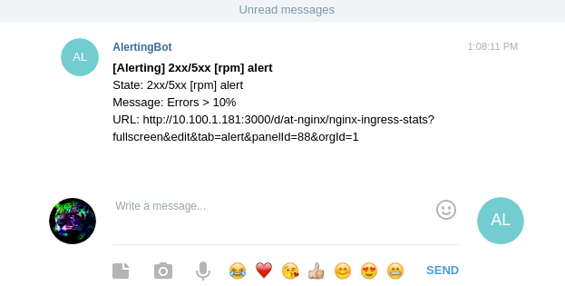

## Getting Started

    kustomize build ./frontend | kubectl apply -f -
    kustomize build ./prometheus | kubectl apply -f -
    kustomize build ./grafana | kubectl apply -f -

### Testing

    #!/bin/bash
    for (( i=1; i <= 1000000000; i++ ))
    do
    curl frontend-static-ip:8080
    done

### Grafana graph

    (sum(increase(nginx_ingress_controller_requests{code=~"5.*",job="frontend"}[50s]))*10)/sum(increase(nginx_ingress_controller_requests{code=~"2.*",job="frontend"}[50s]))

## Forward Grafana port locally

    kubectl port-forward --namespace task1 deployment/grafana 3000

The username and password is `admin`

## Forward Prometheus port locally

    kubectl port-forward --namespace task1 deployment/prometheus-server 9090

## Uninstall

    kustomize build ./grafana | kubectl delete -f -
    kustomize build ./prometheus | kubectl delete -f -
    kustomize build ./frontend | kubectl delete -f -

### or

    kubectl delete ns task1

